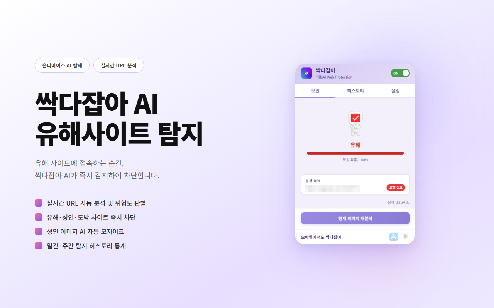
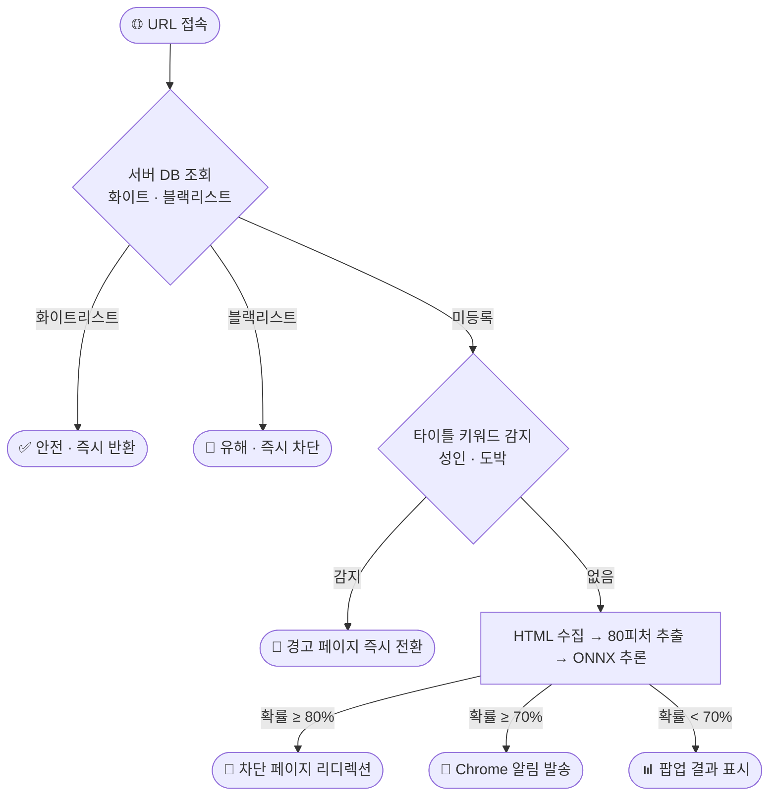
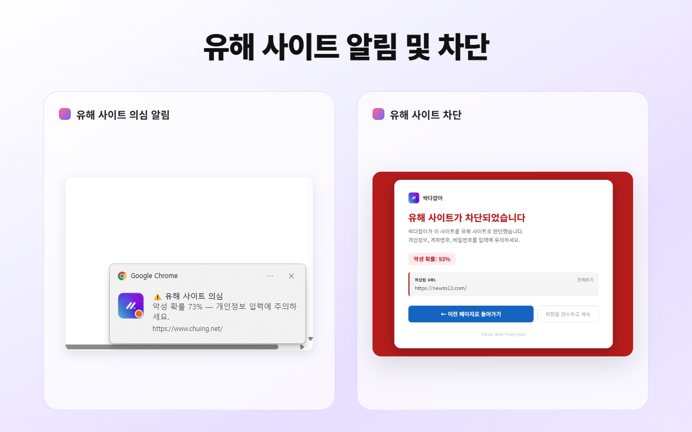
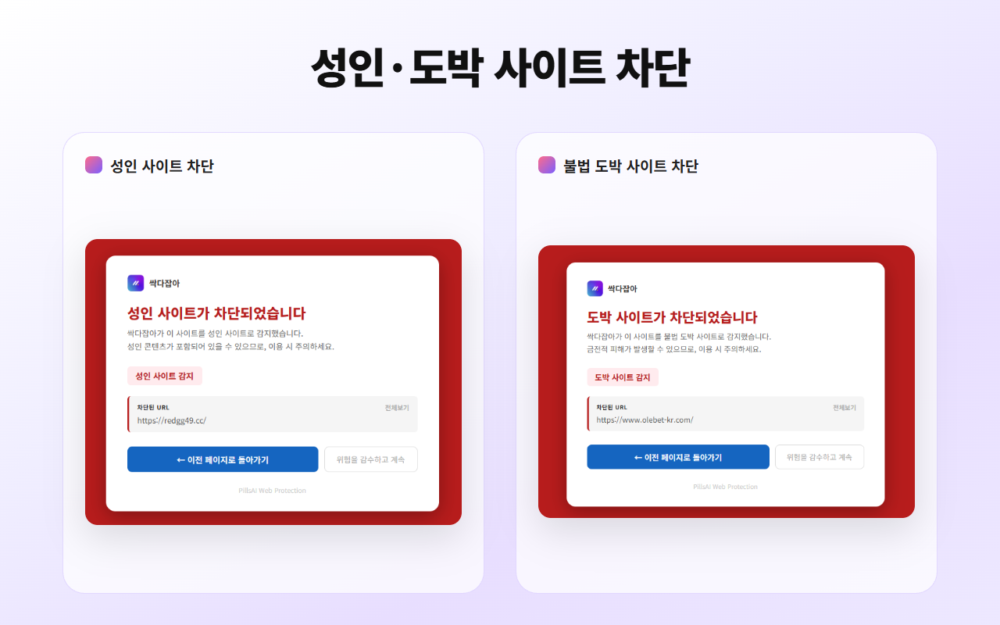
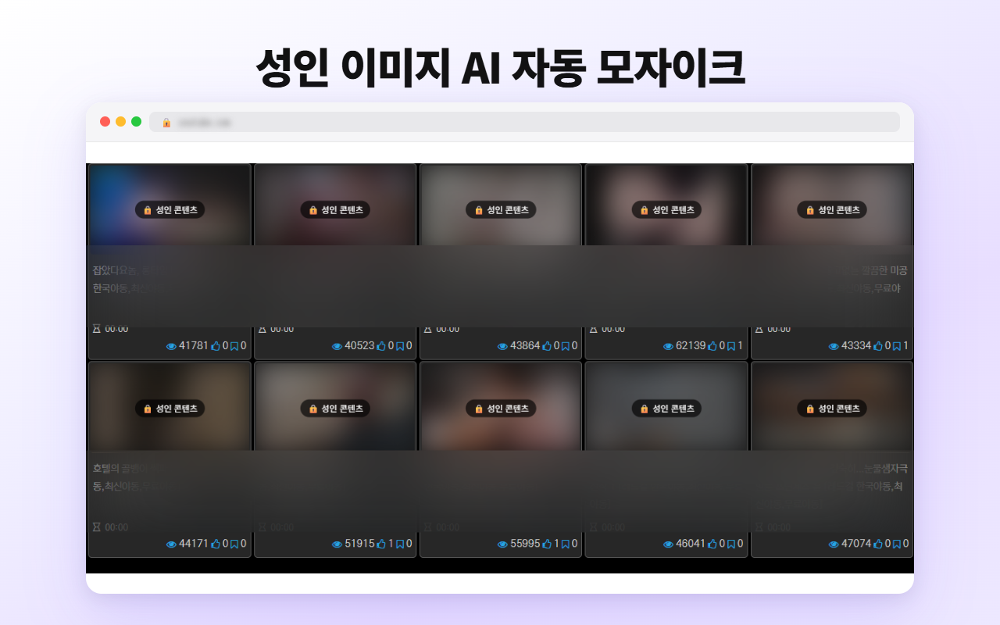
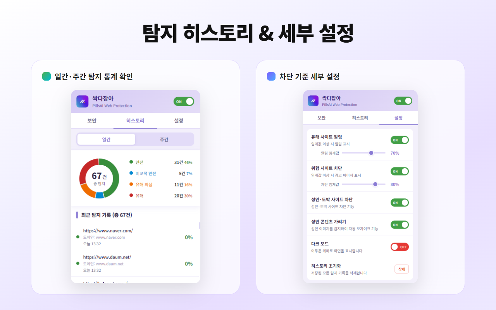

# 필상 AI 유해 사이트 탐지 — Chrome Extension

> AI 기반 실시간 피싱·유해 사이트 탐지 + 성인·도박 키워드 즉시 차단 + 성인 이미지 자동 블러 크롬 확장 프로그램

> 코드는 상업 서비스 보안상 비공개입니다.

---

---

## 탐지 흐름

---

## 주요 기능

<table>
<tr>
<td width="50%" valign="top">

**🧠 AI 유해 사이트 탐지**
- HTML 수집 → 80피처 추출 → ONNX 온디바이스 추론
- 화이트/블랙리스트 즉시 판별 (AI 추론 생략)
- 우클릭 링크 사전 탐지 (방문 없이 즉시 분석)
- 외부 서버 전송 없음 — WASM 로컬 실행

</td>
<td width="50%" valign="top">

**🛡️ 도박/성인 사이트 탐지 & 성인 콘텐츠 탐지**
- 성인·도박 타이틀 키워드 즉시 차단 (한·영 30종+)
- 성인 이미지 자동 블러 (MobileNetV2 온디바이스)

</td>
</tr>
<tr>
<td width="50%" valign="top">

**⚡ 자동 대응**
- Chrome 알림 ≥ 70% · 차단 페이지 ≥ 80%
- 위험도별 툴바 아이콘 실시간 변경 🟢 🔵 🟠 🔴
- 10분/3회 레이트 리밋 · 6시간 전역 쿨다운

</td>
<td width="50%" valign="top">

**📊 히스토리 & 설정**
- 일간·주간 도넛 차트, 최대 999건 Full URL 로그
- 판정 카테고리별 필터링 조회
- 알림·차단 임계값 슬라이더 개별 조정
- 성인·도박 차단 / 블러 / 다크모드 토글

</td>
</tr>
</table>

---

## 탐지 아키텍처

---

## 유해 사이트 알림 및 차단

| 판정 | 악성 확률 | 동작 |
|------|-----------|------|
| ✅ 화이트리스트 | 0% | 즉시 안전 반환 |
| 🟢 안전 | 0 ~ 20% | 팝업 결과 표시 |
| 🔵 비교적 안전 | 21 ~ 50% | 팝업 결과 표시 |
| 🟠 유해 의심 | 51 ~ 80% | 팝업 결과 표시 |
| 🔴 유해 사이트 | 81%+ | Chrome 알림 + 차단 페이지 |
| 🔴 블랙리스트 | 100% | 즉시 차단 |

<table>
  <tr>
    <td align="center"> <b>🗄️ DB 등록 URL</b></td>
    <td align="center"> <b>🟢 안전</b></td>
    <td align="center"> <b>🔵 비교적 안전</b></td>
    <td align="center"> <b>🟠 유해 의심</b></td>
    <td align="center"> <b>🔴 유해 사이트</b></td>
  </tr>
</table>

---

## 성인·도박 사이트 즉시 차단

페이지 `<title>` 태그에 성인·도박 키워드가 포함되면 AI 추론 없이 **즉시 경고 페이지로 전환**합니다.

| 유형 | 키워드 예시 (한·영) |
|------|---------------------|
| 🔞 성인 | 야동, 포르노, 음란, 19금, porn, xxx, nude 등 18종 |
| 🎰 도박 | 카지노, 바카라, 토토, 배팅, casino, gambling, betting 등 19종 |

---

## 성인 이미지 자동 블러

MobileNetV2 기반 NSFW 모델이 웹 페이지 이미지를 실시간 분류해 자동으로 블러 처리합니다. **모델이 클라이언트에 탑재**되어 이미지 데이터가 외부로 전송되지 않습니다.

| | |
|:---|:---|
| 🧠 **온디바이스 분류** | MobileNetV2 로컬 실행 — 이미지 외부 전송 없음 |
| 👁️ **뷰포트 우선** | 화면 내 이미지 우선 처리, 오프스크린은 진입 시 처리 |
| 🔄 **동적 감지** | MutationObserver로 SPA 환경 동적 이미지 자동 처리 |
| 🔓 **클릭 해제** | 블러 이미지 클릭 후 확인 시 원본 표시 |

 
구글 이미지 검색 — 성인 이미지 자동 블러 처리 (🔒 성인 콘텐츠 배지 표시)

---

## 탐지 히스토리 & 설정

<table>
  <tr>
    <td align="center"> <b>📊 일간 통계</b></td>
    <td align="center"> <b>📊 주간 통계</b></td>
    <td align="center"> <b>🗂️ 카테고리 필터</b></td>
  </tr>
</table>

| 항목 | 내용 |
|------|------|
| 📊 도넛 차트 | 일간·주간 판정 비율 + 총 탐지 건수 표시 |
| 🔗 Full URL 로그 | 접속 URL · 도메인 · 시각 기록, 최대 999건 |
| 🎛️ 임계값 조정 | 알림(기본 70%) · 차단(기본 80%) 슬라이더 |
| 🔘 기능 토글 | 성인·도박 차단 / 이미지 블러 / 다크모드 ON·OFF |

---

## 서버 API

| API | 역할 |
|-----|------|
| **DB 조회** `POST` | main_domain 기준 화이트/블랙리스트 조회 |
| **DB 적재** `POST` | 추론 결과 서버 저장 → 라벨링 후 모델 재학습 활용 |

> Google OAuth Bearer 토큰 기반 인증

---

## 기술 구성

| 파일 | 역할 |
|------|------|
| `content.js` | HTML 수집 · 80피처 추출 · 타이틀 키워드 감지 |
| `blur_content.js` | 이미지 NSFW 분류 및 블러 처리 (MAIN world) |
| `background.js` | Service Worker — 추론 총괄, 아이콘, 알림/차단 |
| `offscreen.js` | ONNX WASM 런타임 실행 (Offscreen Document) |
| `popup.js` | 보안·히스토리·설정 3탭 UI |
| **Boosting ONNX** | 피싱 탐지 모델 — F1 0.80, 1.92MB |
| **NSFW 모델** | MobileNetV2 기반 성인 이미지 분류 (nsfwjs v4.3.0) |

---

## 개발 특이사항

- **Manifest V3** — Service Worker + Offscreen Document 조합으로 ONNX WASM 런타임 실행 환경 구성
- **이중 AI 엔진** — 피싱 탐지(ONNX)와 NSFW 분류(MobileNetV2) 동시 탑재, 각 모델 독립 구동
- **온디바이스 추론** — 두 모델 모두 클라이언트 로컬 실행, 외부 전송 없음
- **AI 모델 개선** — F1-score 0.70 → 0.80, 모델 크기 2.42MB → 1.92MB 경량화
- **Google OAuth** — Chrome Identity API `getAuthToken` + Edge `launchWebAuthFlow` 폴백
- **키워드 즉시 차단** — 타이틀 태그 한·영 30종+ 감지, 단어 경계 정규식으로 오탐 방지
- **우클릭 사전 탐지** — URL 피처만으로 ONNX 추론, HTML 피처 0 패딩 동일 모델 사용
- **CORS 우회** — MAIN world → CustomEvent → ISOLATED → background fetch → Blob URL 경유
- **도메인 캐시** — 10분 이내 재방문 시 캐시 재사용, 불필요한 추론·API 호출 제거
- **데이터 파이프라인** — 추론 결과 DB 누적 → 라벨링 → 모델 재학습으로 성능 점진적 개선
- **보안 처리** — JS 난독화 및 암호화 적용 (세부 기법 비공개)
- **단독 개발** — 기획 · 데이터 수집 · 모델 설계 · 개발 · API 연동 · 스토어 출시 전 과정 수행
