# 필상 AI 유해 사이트 탐지 — Chrome Extension

> AI 기반 실시간 피싱·유해 사이트 탐지 + 성인 이미지 자동 블러 크롬 확장 프로그램  
> Chrome Web Store 출시 완료

> 코드는 상업 서비스 보안상 비공개입니다.

---

## 개요

방문하는 모든 URL을 실시간으로 분석하여 **서버 DB 조회 → 온디바이스 ONNX 추론**의 2단계로 피싱·유해 사이트를 탐지합니다.

- **1단계 (서버 DB 조회)**: 화이트/블랙리스트에 등록된 URL은 AI 추론 없이 즉시 결과를 반환합니다. 불필요한 추론 단계를 생략해 응답 속도를 최소화합니다.
- **2단계 (온디바이스 AI 추론)**: 미등록 URL은 Boosting Model ONNX WASM으로 브라우저 내에서 직접 추론합니다. 개인 브라우징 데이터가 외부 서버로 전송되지 않아 프라이버시를 보호합니다.
- **데이터 파이프라인**: 추론 결과는 서버 DB에 누적 수집되며, 라벨링 후 모델 재학습에 활용해 탐지 성능을 지속적으로 개선하는 구조입니다.
- **성인 이미지 자동 블러**: NSFW 이미지 분류 모델이 웹 페이지 내 이미지를 실시간으로 분석해 성인 콘텐츠를 자동으로 블러 처리합니다.

---

## 주요 기능

| 기능 | 설명 |
|------|------|
| 🔍 **2단계 실시간 탐지** | 서버 DB 조회 → 온디바이스 AI 추론으로 모든 URL 실시간 분석 |
| ⚡ **즉시 판별** | 화이트/블랙리스트 등록 URL은 AI 추론 없이 즉시 결과 반환 |
| 🧠 **온디바이스 AI** | ONNX WASM — 외부 서버 통신 없이 브라우저 내 실시간 추론 |
| 🔞 **성인 이미지 자동 블러** | 온디바이스 NSFW 분류 모델 — 웹 페이지 내 성인 이미지 감지 후 자동 블러 처리, 이미지 데이터 외부 전송 없음 |
| 🔔 **자동 알림 · 차단** | 임계값 초과 시 Chrome 알림 + 유해 사이트 차단 페이지 자동 리디렉션 |
| 📊 **탐지 히스토리** | 일간 / 주간 통계 도넛 차트 + 판정별 카테고리 필터링 |
| ⚙️ **맞춤 설정** | 알림 · 차단 임계값 슬라이더 개별 조정, 다크모드, 히스토리 초기화 |

---

## 탐지 아키텍처

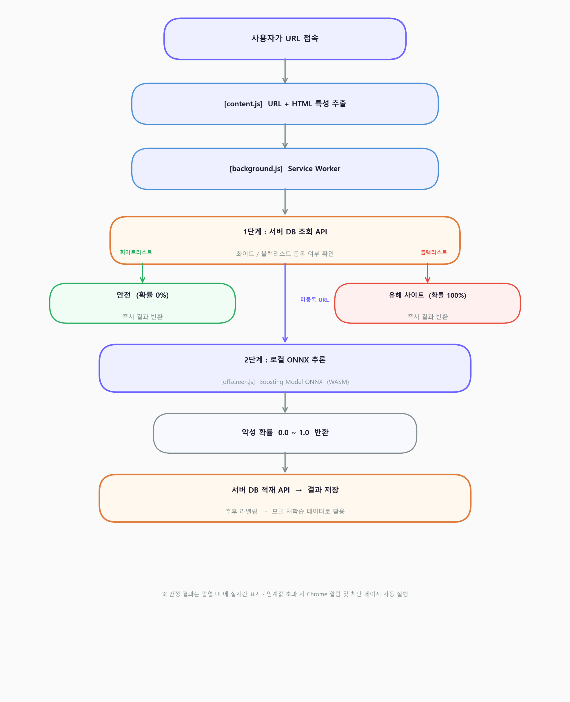

---

## 보안 탭 — 6가지 판정 케이스

화이트/블랙리스트 등록 URL은 DB 조회 후 즉시 결과를 반환하고, 미등록 URL은 온디바이스 AI 추론을 거쳐 악성 확률에 따라 4단계로 판정합니다.

| 케이스 | 악성 확률 | 판정 |
|--------|-----------|------|
| 화이트리스트 등록 URL | 0% (즉시 반환) | 🟢 안전 |
| AI 추론 결과 | 0% ~ 20% | 🟢 안전 |
| AI 추론 결과 | 21% ~ 50% | 🔵 비교적 안전 |
| AI 추론 결과 | 51% ~ 80% | 🟠 유해 의심 |
| AI 추론 결과 | 81%+ | 🔴 유해 사이트 |
| 블랙리스트 등록 URL | 100% (즉시 반환) | 🔴 유해 사이트 |

<table>
  <tr>
    <td align="center">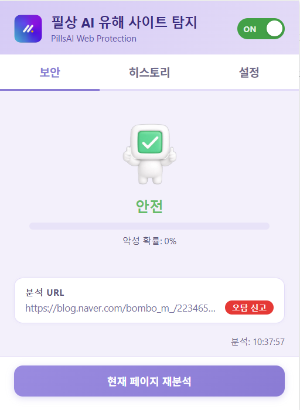 <b>🗄️ DB 등록 URL</b> 화이트리스트 → 확률 0% 블랙리스트 → 확률 100% 즉시 결과 반환</td>
    <td align="center">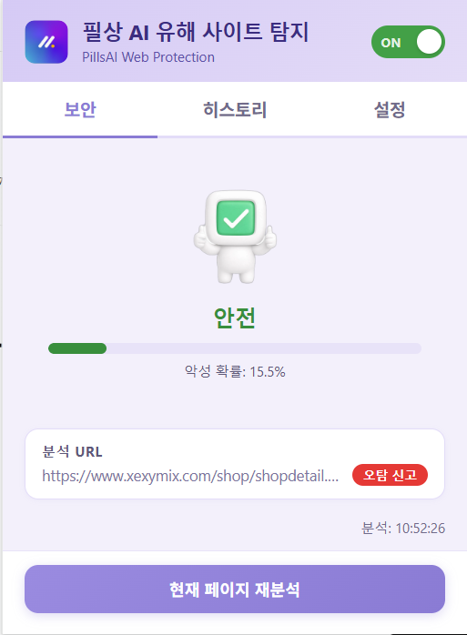 <b>🟢 안전</b> AI 추론 결과 (확률 0 ~ 20%)</td>
    <td align="center">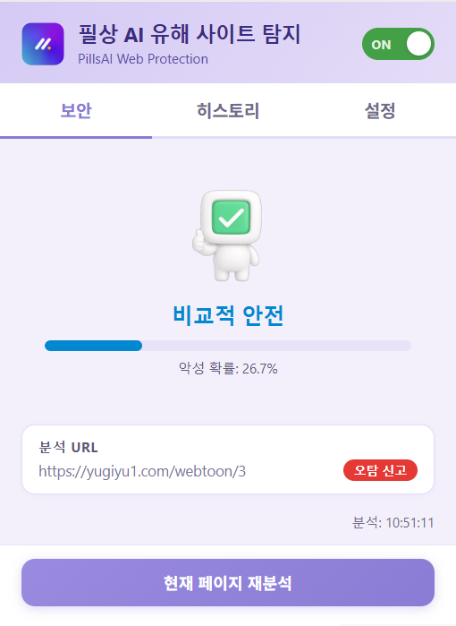 <b>🔵 비교적 안전</b> AI 추론 결과 (확률 21 ~ 50%)</td>
    <td align="center">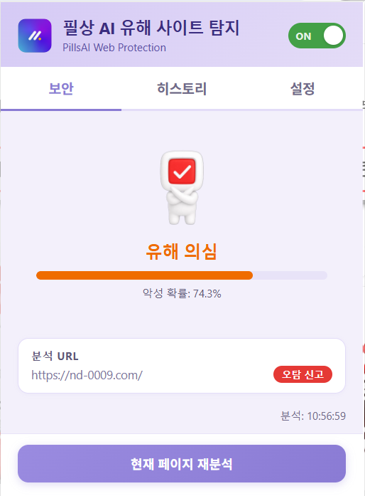 <b>🟠 유해 의심</b> AI 추론 결과 (확률 51 ~ 80%)</td>
    <td align="center">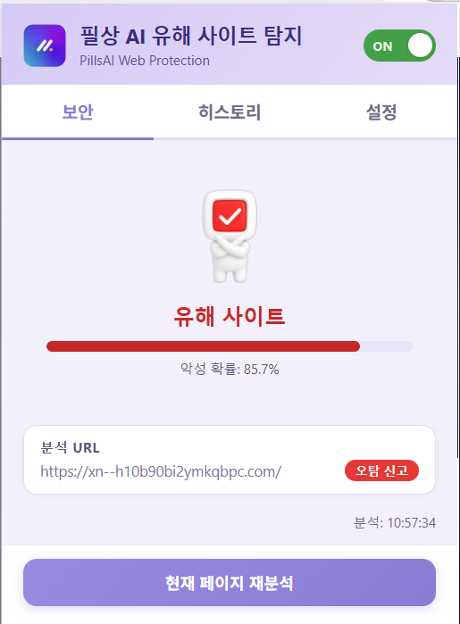 <b>🔴 유해 사이트</b> AI 추론 결과 (확률 81%+)</td>
  </tr>
</table>

---

## 자동 액션 — 임계값 초과 시 자동 대응

사용자가 설정한 임계값을 초과하면 Chrome 알림과 차단 페이지가 자동으로 동작합니다. 두 임계값은 설정 탭에서 개별 조정 가능합니다.

| 임계값 | 기본값 | 동작 |
|--------|--------|------|
| 확률 ≥ 70% | ✅ 활성 | Chrome 알림 표시 |
| 확률 ≥ 80% | ✅ 활성 | 경고 페이지 리디렉션 |

<table>
  <tr>
    <td align="center">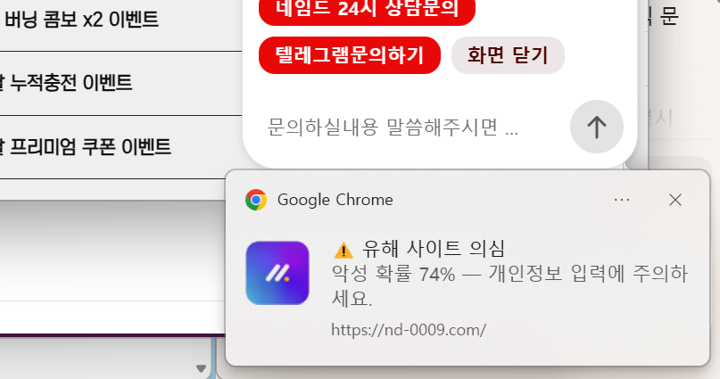 <b>⚠️ Chrome 알림</b> 악성 확률 ≥ 70% · 개인정보 입력 주의 알림</td>
    <td align="center">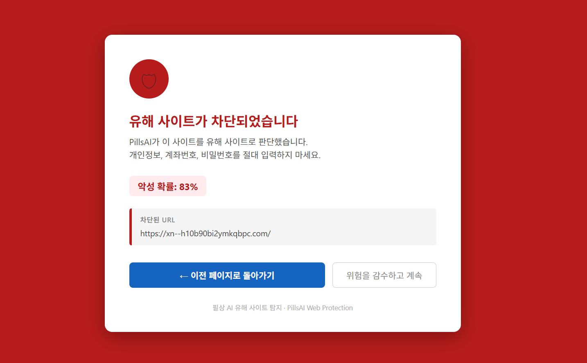 <b>🚫 유해 사이트 차단 페이지</b> 악성 확률 ≥ 80% · 경고 페이지로 자동 리다이렉트</td>
  </tr>
</table>

---

## 성인 이미지 자동 블러

웹 페이지 내 이미지를 실시간으로 분류해 성인 콘텐츠로 판정된 이미지를 자동으로 블러 처리합니다. **NSFW 분류 모델 역시 클라이언트에 탑재된 온디바이스 모델**로, 이미지 데이터가 외부 서버로 전송되지 않습니다. 유해 사이트 탐지 기능과 독립적으로 동작하며, 설정 탭에서 ON/OFF 제어 가능합니다.

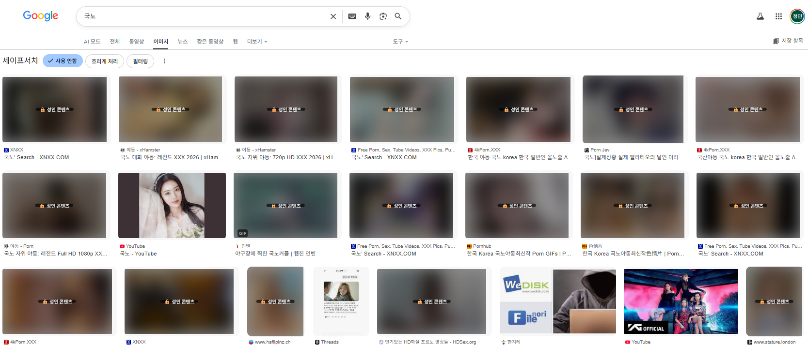 
구글 이미지 검색 — 성인 콘텐츠로 판정된 이미지 자동 블러 처리 (🔒 성인 콘텐츠 배지 표시)

| 특징 | 설명 |
|------|------|
| 🧠 **온디바이스 분류** | NSFW 분류 모델이 클라이언트에 탑재 — 브라우저 내에서 직접 실행, 이미지 데이터 외부 전송 없음 |
| 👁️ **뷰포트 우선 처리** | 화면에 보이는 이미지 우선 분류 · 오프스크린 이미지는 IntersectionObserver로 진입 시 처리 |
| 🔄 **동적 이미지 감지** | MutationObserver로 SPA 환경 등 동적으로 추가되는 이미지도 자동 처리 |
| 🔓 **클릭으로 해제** | 블러 처리된 이미지 클릭 후 확인 시 원본 표시 |

---

## 히스토리 탭 — 탐지 이력 및 통계

방문한 URL의 탐지 결과를 일간 / 주간으로 집계하며, 도넛 차트의 카테고리를 선택하면 해당 판정에 해당하는 URL만 필터링하여 확인할 수 있습니다.

<table>
  <tr>
    <td align="center">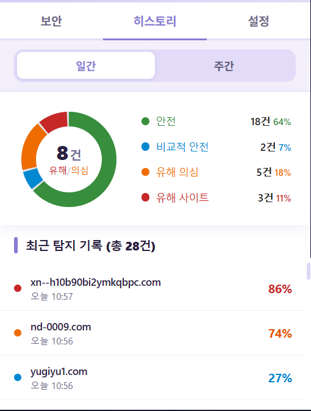 <b>📊 일간 통계</b> 도넛 차트 + 판정별 탐지 내역</td>
    <td align="center">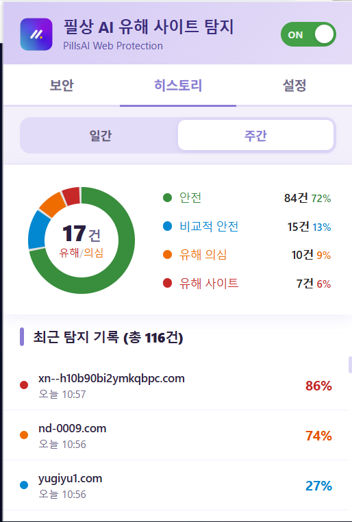 <b>📊 주간 통계</b> 일간 데이터 누적 분석 결과</td>
    <td align="center">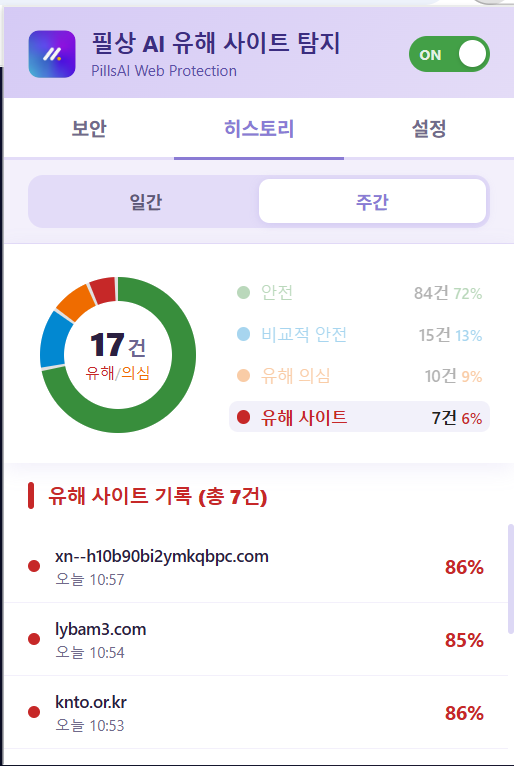 <b>🔴 카테고리별 조회</b> 판정 카테고리 선택 시 해당 기록만 필터링</td>
  </tr>
</table>

---

## 설정 탭 — 사용자 맞춤 설정

알림 임계값, 차단 임계값을 슬라이더로 개별 조정할 수 있으며, 다크 모드 · 성인 이미지 블러 · 히스토리 초기화 기능을 제공합니다.

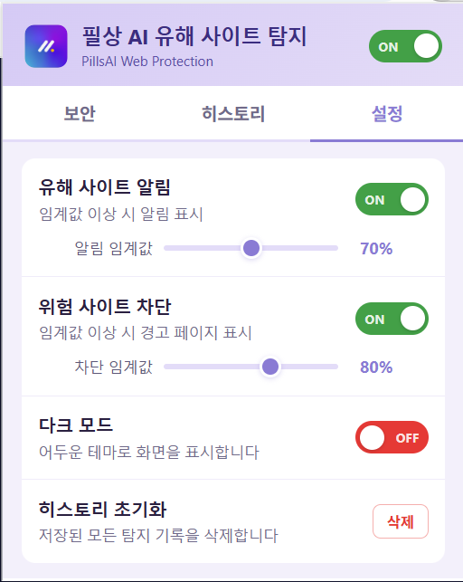 
<b>⚙️ 알림 · 차단 · 블러 · 다크모드 설정</b> 
알림 임계값(기본 70%) · 차단 임계값(기본 80%) · 성인 이미지 블러 ON/OFF · 다크 모드 · 히스토리 초기화

---

## 서버 API 연동

| API | 방식 | 역할 |
|-----|------|------|
| **DB 조회 API** | `POST` | 접속 URL의 화이트 / 블랙리스트 등록 여부 조회 후 즉시 결과 반환 |
| **DB 적재 API** | `POST` | ONNX 추론 결과(URL · 특성 · 예측값)를 서버 DB에 저장 — 수집 데이터는 추후 라벨링 후 모델 재학습에 활용 |

> 두 API 모두 서버 전문가와 협업하여 설계 · 연동하였으며, JS 난독화 및 암호화를 적용하여 보안 처리했습니다 (세부 기법 비공개).

---

## 기술 구성

| 구성 요소 | 역할 |
|-----------|------|
| `content.js` | 페이지 로드 시 URL + HTML 특성 추출 후 background로 전달 |
| `blur_content.js` | 웹 페이지 이미지 실시간 NSFW 분류 및 블러 처리 (MAIN world 실행) |
| `background.js` | Service Worker — DB 조회 API 호출 및 ONNX 추론 흐름 총괄 제어 |
| `offscreen.js` | Offscreen Document — Boosting Model ONNX WASM 런타임 실행 (MV3 제약 우회) |
| `popup.js` | 탐지 결과 UI 렌더링 — 보안 · 히스토리 · 설정 3탭 구성 |
| `Boosting Model ONNX` | 피싱 탐지 온디바이스 추론 모델 — WASM 기반, 네트워크 없이 실행 |
| `NSFW 분류 모델` | 성인 이미지 탐지 온디바이스 분류 모델 (MobileNetV2 기반) |

> Manifest V3의 Service Worker는 백그라운드 지속 실행이 불가하므로, ONNX WASM 런타임은 Offscreen Document를 통해 별도 격리 환경에서 실행합니다.

---

## 개발 특이사항

- **Manifest V3 구조 설계** — Service Worker + Offscreen Document 조합으로 ONNX WASM 런타임 실행 환경 구성
- **이중 AI 엔진** — 피싱 탐지(Boosting Model ONNX)와 성인 이미지 분류(NSFW 모델) 두 가지 AI를 동시 탑재, 각 모델 독립 구동
- **온디바이스 추론** — 두 모델 모두 클라이언트에서 직접 실행. 외부 서버 전송 없이 추론 가능하여 서버 부담이 없으며, 인터넷 미연결 환경에서도 신뢰성 있는 결과 확인 가능
- **Google OAuth 인증** — Chrome Identity API(`getAuthToken`) 기반으로 Google 계정 토큰을 획득하여 API 인증 처리. Edge 환경에서는 `launchWebAuthFlow` 폴백으로 동일한 인증 흐름 지원
- **성인·도박 키워드 즉시 차단** — 페이지 `<title>` 태그에 성인·도박 키워드 포함 시 AI 추론 단계 없이 즉시 경고 페이지로 전환. 유형별(성인/도박/일반 유해) 알림 문구 분기 처리
- **URL 사전 분석 (우클릭 탐지)** — 우클릭 컨텍스트 메뉴를 통해 직접 방문 없이 링크 URL을 사전 분석. URL 구조 피처(75+개)만으로 ONNX 추론을 수행하며, DOM 접근 불가 환경에서 HTML 피처는 0으로 패딩하여 동일 모델로 처리
- **데이터 수집 파이프라인** — 추론 결과를 서버 DB에 지속 누적하여 추후 라벨링 후 모델 재학습에 활용, 탐지 성능의 점진적 개선을 목표
- **보안 처리** — JS 난독화 및 암호화 적용 (세부 기법 비공개)
- **단독 개발** — 기획 · 데이터 수집 · 모델 설계 · 확장프로그램 개발 · API 연동 · Chrome Web Store 심사 제출 전 과정 수행
